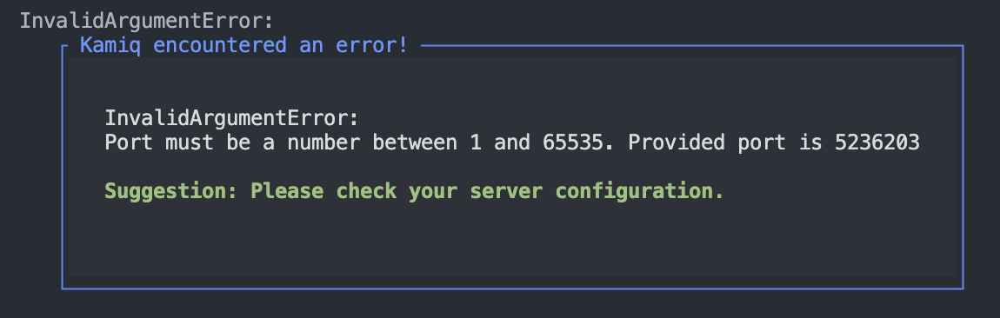

Kamiq
=====
A lightweight, batteries-included TypeScript framework for [Node.js](https://nodejs.org/en) for building declarative server-side applications with high Express.js interoperability.

## Description
Kamiq is a TypeScript framework for building declarative server-side applications with heavy decorator usage. It uses modern Javascript syntax and is build with [Typescript](https://www.typescriptlang.org/), leveraging all of it's features while making Kamiq very descriptive. It combines object-oriented and functional programming approaches to achieve it's minimal syntax design.

Kamiq is built on top of [Express.js](https://expressjs.com/) and by design offers high interoperability with Express.js, enabling the user to easily port over their existing Express.js code including routes, middlewares and more. It is a batteries-included framework, providing out-of-the-box error handling middlewares, custom prettified errors, response structures, file uploading and more.

## Disclaimer!
This project is a personal learning experiment and is not meant to be used for any production or production-like environment. It contains underdeveloped code and is missing a lot of features for it to be suitable for any real-world use. Further development will show where I want to take this project. Currently feel free to use, explore, and offer modifications to the codebase.

## Table of Contents
- [1. Example of usage](#1-example-of-usage)
- [2. Installation](#2-installation)


## 1. Example of usage

### 1.1. Configuring the server

To configure your server, instantiate an object from the Server class. Use the public functions to set your configuration object and any other properties.

```typescript
import 'reflect-metadata' // Requires reflect-metadata due to usage of tsyringe for DI
import * as kamiq from 'kamiq' // Import the framework

// Import a sample controller:
import { SampleController } from './controllers/sampleController'

// Initialize the server and provide basic configuration:
const server = new kamiq.Server({
    port: 3002,
    controllers: [SampleController],
    cors: true,
    jsonBodyParser: true,
})

server.start() // Start the server.
```

### 1.2. Controller and route example

```typescript
import { BaseController, Get } from "kamiq"; // Import the BaseController and the Get decorator

export class SampleController extends BaseController {
    path = '/ping' // Base path for the following routes.

    @Get('/test') // Get controller registeres the route with a GET method and handles errors
    ping() {
        this.ok('pong') // Usage of helper functions for returning JSON data
    } 
}
```

## 2. Installation

### 2.1. Installing the framework and dependencies

Firstly, install `reflect-metadata` shim (reqired due to usage of `tsyringe`):**

```
npm install reflect-metadata
```

Install the `Kamiq` framework:

```
npm install kamiq
```

### 2.2. Configuring your project

Make sure you have he following settings in your `tsconfig.ts`:

```json
{
  "emitDecoratorMetadata": true,
  "experimentalDecorators": true
}
```

## 3. Introduction

NOTE: This chapter serves as a brief introduction to the workings and principles of Kamiq. Later chapters will eloquetly cover all concepts mentioned here in great detail.

### 3.1. Getting started

#### 3.1.1. Server class

In Kamiq, your application lives in the `server` object. To get started, import and instantiate an object from the Server class in your root file (usually `server.ts` or `app.ts`):

```typescript
import * as kamiq from 'kamiq'

const server = kamiq.Server({
  // configuration properties  
})
```

The server class takes in a configuration object (will be covered in later chapters), containing the most important configuartion settings (note that these are just the most important properties listed here):

```typescript
    /*
     * An array of controller classes that should be registered with the Express server. Each controller class should be a subclass of `BaseController`.
     */
    controllers: Array<new () => BaseController>
  
    /**
     * The port number the server should listen on. If not provided, the default is 3001.
     */
    port?: number
  
    /**
     * Whether to use the `express.json()` and `express.urlencoded()` middleware for parsing JSON and URL-encoded bodies. If not provided, the default is false.
     */
    jsonBodyParser?: boolean
  
    /**
     * An optional configuration object for the CORS middleware. If provided, the server will use this
     * configuration to set up CORS. The object can include properties such as `origin`, `methods`,
     * `allowedHeaders`, etc. to control the CORS behavior. If not provided, the server will use
     * default CORS settings.
     */
    cors?: boolean

```


Let's take a look at a minimal server configuration object:

```typescript
{
    port: 3002,
    controllers: [SampleController], // array of controller classes
    cors: true,
    jsonBodyParser: true,
}
```

The `Server` class contains many public functions, such as getters and setters for different properties. The one that we currently need is for starting the server:

```typescript
server.start()
```

Calling the following function will trigger all neccessary configuration for starting the server, including registering all  middlewares and routes and more. Mistakes in the configuration of the server will result in Kamiq throwing a custom Error with suggestions for resolving them. A successfull configuration results in the following result:

```typescript
Server is listening on port 3002. // Default port.
```

#### 3.1.2. Controllers

One property of the server config object we didn't cover is the `controllers` property. This is an array that takes in your controller classes that extend the `BaseController` class. Let's create a new file under `./controllers` and name it `SampleController.controller.ts` with the following contents:

```typescript
import { BaseController, Get } from "kamiq";

export class SampleController extends BaseController {
    path = '/ping'

    @Get('/test')
    ping() {
        this.ok('pong')
    } 
}
```

Kamiq focuses on heavy decorator use, resulting in highly declarative controller code. Each controller class extends the `BaseController` class that abstracts the route registering logic, along with hanlding middleware and errors (more on this later).

The `path` property is the controller-level path that all routes in this contoller will be prefixed to. The following example route with the handler `ping()` results in the following path: `/ping/health`.

The `Get('/test')` decorator registeres the route with the `GET` method. It takes in one string argument which is the route-specific path suffix.

### 3.2. Paramters

### 3.3. Error handling

By default, all route handlers are async functions, so no need to declare the handler as async. In addition, all routes are wrapped in an `requestErrorHandler` middleware which wraps the handler in a try/catch block.

By default, controller-level caught errors are handled with the `defaultErrorHandler` middleware and the `defaultErrorLogger` middleware. In combination, they log the error to the console and respond to the client with the following interface (properties are self-explanatory):

```typescript
export interface ErrorResponse {
    response: string
    error: {
      type: string
      path: string
      statusCode: number
      message: string
    }
  }
```

A `BaseError` class extends the `NodeError`, making it trivial to write your own custom errors. Simply extend the `BaseError`, add your own logic and due to the fact all route handlers are wrapped in a try/catch block, simply throw your custom Error:

```typescript
@Get('/test')
    ping() {
        
        throw new CustomError("my error message!")

        this.ok('res')
    } 
```

and Kamiq will handle everything for you.

### 3.4. Middlewares

Custom middlewares can be run by simply using the `Middleware()` decorator on a route:

```typescript
@Middleware(myCustomMiddleware)
@Get('/test')
    ping() {
        // ...
    } 
```

where `myCustomMiddleware` is an Express middleware function. Accepted middleware functions are of the following type:

```typescript
interface MiddlewareFunction {
  (req: Request, res: Response, next: Next): void
}
```

allowing you to directly port your old Express code to Kamiq.

Middlewares can be also chained, where the order of operations are respected:

```typescript
@Middleware(myCustomMiddleware)
@Middleware(myCustomMiddleware2)
@Get('/test')
    ping() {
        // ...
    } 
```

### 3.5. Guards

Guards are special middlewares, that must obey the single responsiblity rule. They're intended usecase is to handle authorization and authentication responsiblities. They have access to the `Request` object, and must return a `boolean | Promise<boolean>` type:

```typescript
@Guard(myGuard)
@Get('/test')
    ping() {
        // ...
    } 
```

Regardless of middleware order, Guard logic always takeds precedence, therefore is always executed before other middleware functions.

Guards also support configuration options. Currently, there is only one option:

```typescript
@Guard(myGuard, { ignore: true })
@Get('/test')
    ping() {
        // ...
    } 
```

which allows you to ignore the guard and immediately skip to the next function in the request lifecycle.

### 3.6. Operations

Operations are a Kamiq-specific function type that aide with inter-layer communication within your codebase. Let's consider a simple backend architecture, consisting of three layers: presentation, service and data-access layer.

Error handling should be handled at the controller level, making the communication between the layers troublesome, considering any logic may error. Also, this raises the question of how to handle user-invoked errors at sub-controller levels.

Any general function can be an Operation by attaching the `Operation()` decorator to it.

Operation functions are general functions that are wrapped in a try/catch block and have a standardized `OperationResut` return type:

```typescript
export type OperationResult<T> = { success: true; data: T } | { success: false; error: Error }
```


This ensures any `Operation` function will return an object with the `success` property set to `true` if the operation was successfull together with the `data` property. In case of failure, `success` will be `false`, and the `error` property will be returned, making it very simple for the receiver of the result to conditionally handle errors:

```typescript
// Operation function

class MyService {

    @Operation
    static myOperationFunction() {
        throw new Error("oops!")
    }

}

// Operation receiver
function mockControllerFunction() {
    const operationResult = MyService.myOperationFunction()

    // handling the result:
    if (operationResult.error) {
        // handle error case
    }

    const result = operationResult.success
    // continue...
}

```

Tip: Combine service level functions as Operations with the controller-level error handling to create bulletproof controller-service logic.

### 3.6. Kamiq errors

Kamiq offers descriptive, prettified framework-level error handling to make it as responsive and informative as possible. If you make any configuration or definition errors at the framework level, Kamiq will throw it's custom error to help you resolve the problem. Here's an example of such error being thrown, invoked due to a misconfigured `port` variable:



Kamiq also handles `unhandledRejection` and `uncaughtException` errors in a similar fasion. All errors are followed with the stack trace of where it was invoked.

## 4. Plans for the future

I have just began working on this project, so here are some short rough todos I plan to tacle in the future:

### 4.1. High priority
1. Publish to NPM
2. Write a full documentation
3. Refactor the Server class
4. Add release notes
5. All support for providing custom error and error logger middlewares
6. All file upload and processing support
7. Add support for server-wide loggers
8. Add custom errors and handle more errors

### 4.2. Low priority
1. Add support for registering vanilla express routes
2. Add support for registering server-wide middlewares
3. Refactor Middleware decorator (interface, support for Before/After route handler execution)
4. Refactor Guards (decorator logic, interface)
5. Exception Filters
### 4.1. Backburner priority
1. Write more examples
2. Re-do all JSDoc descriptions
